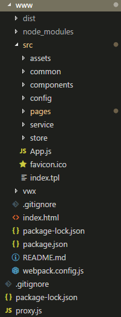

# 初始化安装

## Npm

```
npm i
```
## 目录结构

# 开发调试
```
npm run dev
```
* 修改webpack配置文件
```
    devServer: {
        historyApiFallback: true,
        noInfo: true,
        host: "192.168.1.155",
        port: 8080,
        publicPath: '/'
    }
```
host修改为本机ip

# 发布
```
npm run build
```

# 项目使用

* 页面添加添加
  打开pages/pages.js文件，修改页面路由地址

```javascript
import index from './demo/index/index.js';
//动态按需载入
const modal = () => import('./demo/modal/modal.js');
export default [
        { path: '/', component: index, name: "index" },
];

```
# A属性
## config
- A.config.req
```javascript
req: {
  	//请求头部修改
    headers: { 'Content-Type': 'application/x-www-form-urlencoded;charset=UTF-8' },
    //请求默认传输数据
    data: {
      unionid: 'owI24wiLVt0MI045iF1C1c8fIiGE'
    }
}
```
- A.config.host
	默认服务器主机地址
  ```javascript
    host() {
        return "http://ptq.yangwl.com";
    }
  ```
- A.config.dPage
	默认页面定位
- A.config.dApi
	常用数据缓存接口
```
dApi:{
    "/WeChatAppsCs/Member/index":true
  }
```
# A方法
  - R()
  	url地址可以是完整路径，也可以是省略服务host地址
  ```javascript
    A.R({
  	  url: 'test.php', //仅为示例，并非真实的接口地址
      data: {
         abc: 123
      },
      header: {
          'content-type': 'application/json' // 默认值
      },
      success: function(res) {
        console.log(res.data)
      },
      fail:function(err){
      	//失败处理
      }
    })
  ```
  - RS()
  ```javascript
  	//带有参数
	A.RS({ url: "/WeChatAppsCs/Member/index",data:{abc:123}}).then(res => {
    	...
    }, err => {
    	...
    })
    //字符串url地址
	A.RS("url...").then(res=>{
    	...
    },err=>{
    	...
    })
  ```

# page说明
   * onLoad
    // 生命周期函数--监听页面加载
    
   * onReady
    // 生命周期函数--监听页面初次渲染完成
    
   * onShow
    // 生命周期函数--监听页面显示
    
   * onHide
    // 生命周期函数--监听页面隐藏
    
   * onUnload
    // 生命周期函数--监听页面卸载
   
   * onShareAppMessage
    //用户点击右上角分享

# wx方法
   (包含weui方法 文档参考 https://github.com/Tencent/weui.js/blob/master/docs/README.md )
  - setStorageSync
  - getStorageSync
  - requestPayment
  - [actionSheet](https://github.com/Tencent/weui.js/blob/master/docs/component/actionSheet.md)
  - [alert](https://github.com/Tencent/weui.js/blob/master/docs/component/alert.md)
  - [confirm](https://github.com/Tencent/weui.js/blob/master/docs/component/confirm.md)
  - [dialog](https://github.com/Tencent/weui.js/blob/master/docs/component/dialog.md)
  - [form](https://github.com/Tencent/weui.js/blob/master/docs/component/form.md)
  - [gallery](https://github.com/Tencent/weui.js/blob/master/docs/component/gallery.md)
  - [loading](https://github.com/Tencent/weui.js/blob/master/docs/component/loading.md)
  - [picker](https://github.com/Tencent/weui.js/blob/master/docs/component/picker.md)
  - [searchBar](https://github.com/Tencent/weui.js/blob/master/docs/component/searchBar.md)
  - [slider](https://github.com/Tencent/weui.js/blob/master/docs/component/slider.md)
  - [tab](https://github.com/Tencent/weui.js/blob/master/docs/component/tab.md)
  - [toast](https://github.com/Tencent/weui.js/blob/master/docs/component/toast.md)
  - [topTips](https://github.com/Tencent/weui.js/blob/master/docs/component/topTips.md)
  - [uploader](https://github.com/Tencent/weui.js/blob/master/docs/component/uploader.md)